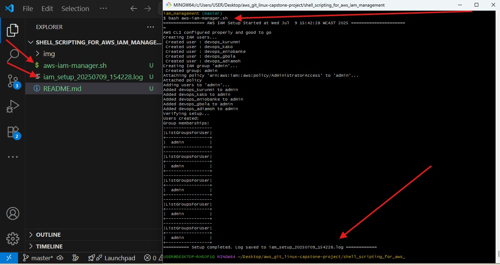
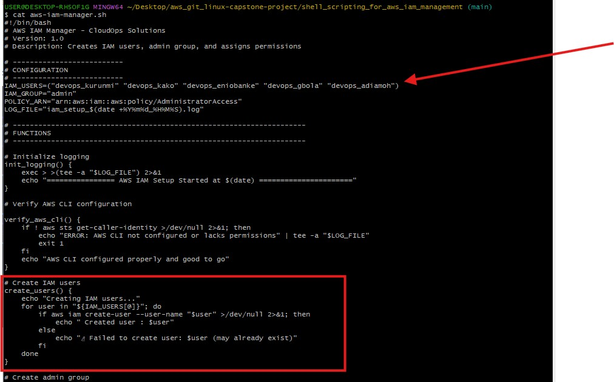
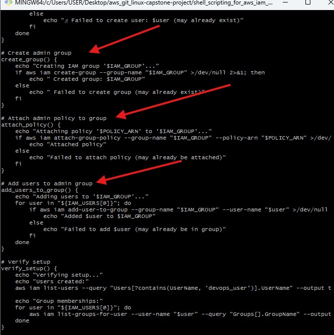
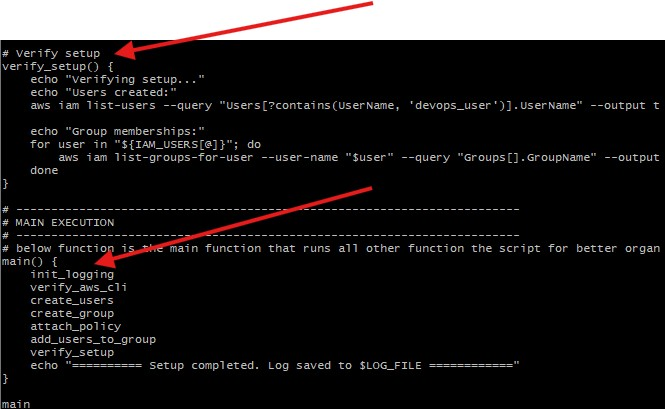

#   Shell Scripting for AWS IAM Management Project 

## Readme URL Below: 

https://github.com/Agbedeyisegun/3mtt-project/blob/main/darey.io/aws-iam-mini-project
/README.md

## Below are the steps and screenshots of the of the project

- step 1 Introduction
This script automates AWS IAM user and group management for CloudOps Solutions. It:

Creates 5 IAM users

Creates an admin group

Attaches the AdministratorAccess policy

Adds all users to the group

- step 2  Design Decisions
Modular Functions: Each task (user creation, group setup) is separated for clarity.

Error Handling: Gracefully skips existing resources instead of failing.

Logging: All operations are logged to a timestamped file.

Verification: Includes a final check to confirm setup success.

- step 3 How to Use

Save the script as aws-iam-manager.sh

Make the file executable with the below cmd:
`chmod +x aws-iam-manager.sh`

Run the script with:
`./aws-iam-manager.sh`

Check logs with the below cmd:

`cat iam_setup_*.log`

- step 4 Verification Commands
To manually verify:

bash
# List all IAM users
aws iam list-users

# Check group memberships
aws iam list-groups-for-user --user-name devops_user1

# Verify policy attachment
aws iam list-attached-group-policies --group-name admin

✅ Documentation:

Explains design decisions

Provides usage instructions

Includes verification steps

- Step 1 
Screenshot of the terminal showing the script run and how successful it is with the file it created called "iam_setup_20250709_154228.log" 

- Step 2
link to the log file for the script file below:
"aws-iam-manager.sh" 

- Step 3 
Screenshot of the terminal showing the script creation of the arrays of users to be created by the script. With this below users "devops_kako" "devops_eniobanke" "devops_gbola" "devops_adiamoh". Also using "if" statement to to iterate through the arrays and create the users menetioned.

- Step 4 
Screenshot of the terminal showing the script creation of the group called "admin" attached a policy called "arn:aws:iam::aws:policy/AdministratorAccess"
 with "if" statement then attached it to the this below users "devops_kako" "devops_eniobanke" "devops_gbola" "devops_adiamoh" to the "admin" group.

- Step 5 
Screenshot of the terminal showing the script verifying all the necessary resources if they are properly created, and the all the functions was called with the "main" as the main function for all the functions. below are the functions:  "init_logging", "verify_aws_cli", "create_users", "create_group", "attach_policy", "add_users_to_group", "verify_setup".
